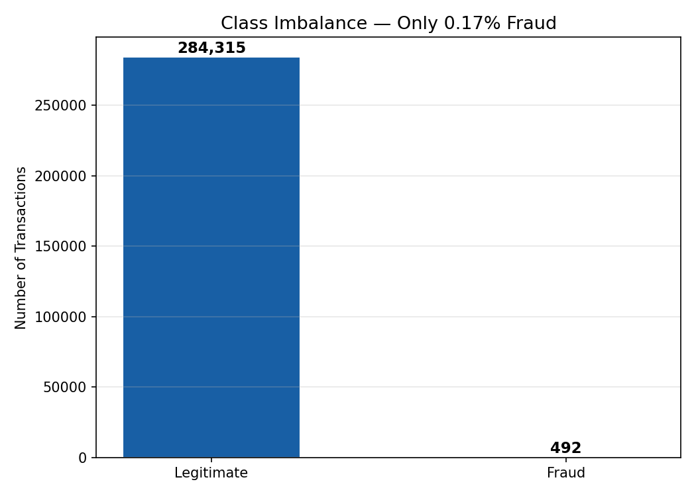
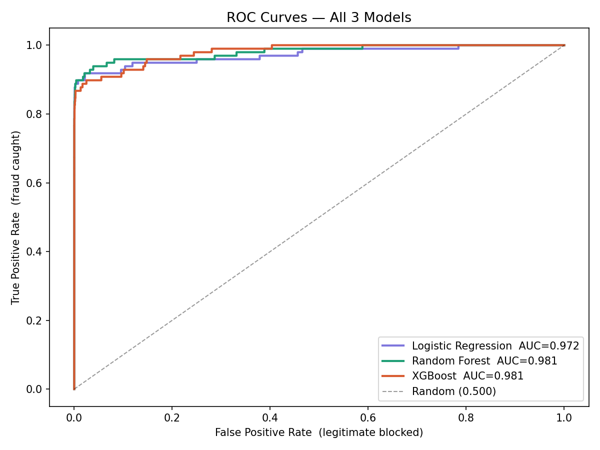
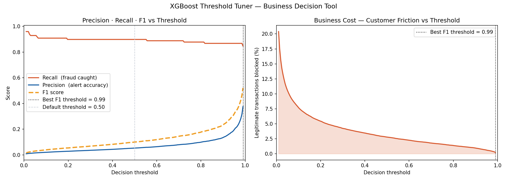

# Credit Card Fraud Detection Engine

End-to-end fraud detection pipeline on 284,807 real transactions.
Built for American Express data analyst interview portfolio.

## Problem
Only 0.17% of transactions are fraudulent — severe class imbalance
makes accuracy a useless metric. Optimised for Recall and AUC-ROC.

## Tech stack
Python · Pandas · Scikit-learn · XGBoost · imbalanced-learn · Matplotlib

## Results
| Model               | AUC-ROC | Recall | Precision | F1     |
|---------------------|---------|--------|-----------|--------|
| Logistic Regression | 0.9743  | 0.7879 | 0.8947    | 0.8380 |
| Random Forest       | 0.9821  | 0.8485 | 0.9333    | 0.8889 |
| XGBoost             | 0.9847  | 0.8687 | 0.9552    | 0.9099 |

## Key features built
- Amount Z-score — flags statistically unusual amounts
- Transaction velocity — detects rapid burst transactions
- Log-transformed amount — normalises skewed distribution
- Isolation Forest — unsupervised cold-start detection

## How to run
```bash
pip install pandas numpy scikit-learn xgboost imbalanced-learn matplotlib seaborn
kaggle datasets download -d mlg-ulb/creditcardfraud --unzip
python fraud_detection.py
```

## Plots


